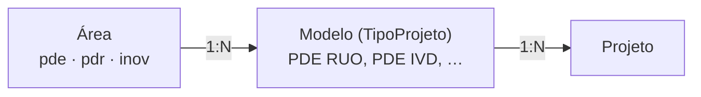

# Plano — Projetos unificados (PDE · PDR · INOV)

## De onde veio

Conversa com o André em 2026-09-30. Ele é gestor de todas as áreas e quer:

- **Um só Projetos** para PDE, PDR e INOV, em vez de um por departamento.
  Serve de visão geral para ele e ajuda a padronizar.
- **Separar por etiqueta, não por aba.** Um filtro, e não telas separadas.
- **Gerenciar por modelo.** Os tipos de projeto viraram cadastráveis
  (PR #37), então dá para ter um modelo por combinação:
  `PDE RUO` · `PDE IVD` · `PDR RUO` · `PDR IVD` · `INOV`.
- **Um filtro de um ou mais modelos** nas outras abas (Dashboard, PMO).

A ideia de cada colaborador ver só a própria área **ficou para depois** (ver
[Fora deste plano](#fora-deste-plano)). Ele ainda tem outros pontos sobre essa
tela, que ficam para uma segunda conversa.

## O que já existe e ajuda

| Peça | Estado |
|---|---|
| Módulo Projetos (entregáveis, PMO/EVM, baseline, snapshots) | Não guarda nada específico de equipamento; o domínio já serve às três áreas |
| Tipos de projeto cadastráveis, cada um com seu modelo de entregáveis | Pronto (PR #37). **O "modelo" do André é o `TipoProjeto`** |
| "Copiar modelo de um tipo existente" ao criar um tipo | Pronto: os 5 modelos novos nascem da lista do OEM |
| Filtro `?tipo=` na API | Existe, mas aceita **um** valor e só a listagem e o export o usam |
| Áreas (`areas.py`) | `pde` e `pdr`. **INOV não existe** |

## O que falta

1. **O modelo não sabe de que área é.** Sem isso, o filtro não consegue agrupar
   por área nem pintar a etiqueta com a cor dela.
2. **INOV não é área.** Não tem slug nem hub.
3. **O filtro não chega às outras abas.** Dashboard, PMO, `/alertas` e `/resumo`
   ignoram o tipo.
4. **Só se entra em Projetos pelo PDE.** O card só existe no sub-hub do PDE.

## Proposta

### O modelo é a etiqueta

- A **área passa a ser atributo do modelo**: uma coluna nova em
  `tipos_projeto.area`.
- A **área do projeto é derivada do modelo**, e não guardada no projeto. Assim
  há uma fonte só. Se houvesse um campo `area` no projeto, daria para ter um
  projeto `PDR RUO` marcado como PDE.
- **RUO/IVD fica no nome do modelo.** Para ver todos os IVD, basta marcar
  `PDE IVD` + `PDR IVD` no filtro. Um eixo regulatório à parte só vale a pena
  se aparecer relatório por classe que o filtro não resolva.
- **Etiqueta livre não entra.** Ela divergiria da área e deixaria a futura
  separação por área sem base.
- Projeto legado sem modelo (`tipo = ""`) conta como **PDE**, porque até aqui o
  módulo só existia para o PDE.

### Um filtro para todas as abas

- Fica **acima das abas**, e não repetido em cada uma. O mesmo filtro vale para
  Dashboard, PMO, Projetos e o export. A escolha feita numa aba continua valendo
  ao trocar de aba.
- Aceita **vários modelos**, agrupados por área. Clicar no nome da área marca
  todos os modelos dela.
- De onde vem o estado inicial, em ordem de prioridade: parâmetro na URL
  (`?area=pdr`, `?modelo=PDE IVD`), depois a última escolha
  (`localStorage`), depois tudo.
- A **etiqueta do modelo** aparece na cor da área no card do projeto, na ficha e
  na lista de risco do PMO.
- Na tela, **"Tipo" passa a se chamar "Modelo"**, que é como o André fala. No
  código continua `tipo`.

### Navegação

- `/projetos` continua **uma página só**.
- O card **Projetos** aparece no sub-hub do PDE (já está lá) e no do INOV, e a
  sidebar do PDR ganha um link. Os três levam a `/projetos?area=<slug>`, já
  filtrado pela área de onde a pessoa veio.
- O botão de voltar leva ao hub de origem.

### Quem vê o quê: nada muda

As permissões continuam como estão:

- admin e gestor veem todos os projetos;
- o técnico vê só onde tem entregável atribuído, sem valores em R$.

O filtro por área é **só um recorte de visão**: não é controle de acesso.

## Fases

### Fase 0 — Decisões com o André

São as da seção [Decisões em aberto](#decisões-em-aberto). A decisão 1 trava a
Fase 4; as outras podem ser resolvidas durante o trabalho.

### Fase 1 — Área no modelo + INOV

- `migrations/017_area_tipo_projeto.py`: `ALTER TABLE tipos_projeto ADD COLUMN
  area VARCHAR(20) NOT NULL DEFAULT 'pde'`. O padrão é `pde` porque todos os
  tipos atuais são do PDE. Segue o padrão idempotente das outras migrations, e
  a mesma coluna entra em `servidor._sync_schema` (ADR-0002).
- `models.TipoProjeto.area` + `to_dict()`.
- `areas.py`: nova entrada `inov` (nome, cor, `home: /hub/inov`,
  `modulos: [Projetos]`).
- `entregaveis.py`, rotas `/api/tipos-projeto`: `area` passa a ser obrigatória
  no POST e editável no PUT, validada contra `AREA_SLUGS`. O nome continua único
  no sistema inteiro.
- Testes: estender `tests/test_projetos_tipo.py`.

### Fase 2 — Filtro de modelos + etiquetas

**Servidor (`entregaveis.py`)**

- `_filtrar_projetos`: `tipo` e `area` passam a aceitar vários valores
  (`request.args.getlist`), sem quebrar quem manda um `tipo` só. `area` resolve
  para os modelos daquela área, e o `tipo = ""` legado conta como `pde`.
- `/alertas` e `/resumo` passam a usar `_filtrar_projetos`, como a listagem e o
  export já usam.
- Criar um projeto passa a **exigir um modelo**. Hoje `""` é aceito, e um
  projeto sem modelo não teria etiqueta nem área.

**Tela (`templates/entregaveis.html` + `static/entregaveis.js`)**

- Barra de filtro acima de `.ent-tabs`, com um botão "Modelos: todos ▾", um
  popover de checkboxes agrupados por área e chips para os modelos
  selecionados. No celular, o popover vira folha (`mobile.css`).
- Um estado único `_filtroModelos` e um `filtroQS()` anexado a todas as
  chamadas (`/api/projetos`, `/resumo`, `/alertas`, export). Mudar o filtro
  recarrega a aba que está aberta.
- Por aba:
  - **Dashboard**: o seletor "Projeto" lista só os projetos filtrados, e os KPIs
    e gráficos são recalculados.
  - **PMO**: o quadrante SPI×CPI, o risco e o financeiro usam só o recorte. A cor
    do ponto pela área é opcional.
  - **Projetos**: etiqueta do modelo no card.
  - **Modelos**: o seletor de modelos passa a agrupar por área, e "+ Novo modelo"
    pede a área.
- Formulário de projeto: o seletor de modelo usa `<optgroup>` por área e passa
  a ser obrigatório.
- Export Excel/PDF: colunas Modelo e Área, e o filtro aplicado aparece no
  cabeçalho.

**Testes**: o filtro com vários `tipo`, com `area` e com o legado sem modelo, na
listagem, em `/alertas`, `/resumo` e no export.

### Fase 3 — Navegação

- `areas.py`: o card Projetos no sub-hub do INOV.
- `pdr/templates/pdr/dashboard.html`: link "Projetos" na sidebar, visível para
  gestor, apontando para `/projetos?area=pdr`.
- O botão de voltar de `/projetos` leva ao hub de origem, e cai em `/hub` se não
  houver origem.
- O André recebe a área `inov` no cadastro, para o card do INOV aparecer no hub
  dele.

### Fase 4 — Virada dos dados reais + documentação

1. Backup do banco (PostgreSQL de produção).
2. Aplicar a migration 017.
3. Criar os 5 modelos na aba Modelos, copiando do OEM. O André revisa a lista de
   entregáveis de cada um.
4. Reclassificar os projetos existentes com uma tabela de/para validada pelo
   André. **Trocar o modelo de um projeto existente muda só a etiqueta:** os
   entregáveis continuam como estão.
5. Aposentar OEM e Revenda, se for a decisão. A exclusão só é permitida quando
   nenhum projeto, nem arquivado, usa o tipo.
6. Documentação:
   - `funcional/projetos-entregaveis.md`: modelo, área e filtro;
   - `funcional/acesso-usuarios.md`: a área INOV;
   - `CHANGELOG.md`.

## Decisões em aberto

| # | Pergunta | Recomendação |
|---|---|---|
| 1 | **OEM/Revenda** somem, viram parte do nome do modelo (`PDE IVD OEM`) ou continuam como outra informação? | Somem como modelo. Se ainda fizer diferença, entram depois como um campo simples do projeto, que não muda o modelo aplicado. O `tipo` OEM/Revenda do módulo Custos é outro conceito e não muda |
| 2 | O **INOV** tem só Projetos ou também Tempos, Missões e Custos? | Só Projetos por enquanto. Os outros são uma entrada a mais em `areas.py` quando pedirem |
| 3 | As **categorias fixas** de entregável (Produto, Sistema, Documentação, Capacitação, Marketing) servem para reagentes e inovação? | Começar como está e marcar N/A no que não se aplica. Categoria por modelo seria outra obra |
| 4 | Ao abrir, o André vê **todos os modelos** ou a última seleção dele? | A última seleção. "Todos" é o padrão da primeira vez |

## Para mostrar hoje à tarde

A fatia que dá para mostrar é a **Fase 1 mais a Fase 2, rodando local** com
dados de demonstração (`scripts/seed_demo.py`): os 5 modelos, projetos
fictícios em cada um, o filtro de vários modelos em todas as abas e as
etiquetas. Isso mostra ao André a ideia funcionando e alimenta as decisões da
Fase 0.

## Fora deste plano

- **Quem vê o quê por área.** A ideia é que cada colaborador veja só a área dele
  e o André veja tudo. Ficou para quando a ideia amadurecer. Hoje Projetos só
  confere o papel, e não a área: enquanto o André for o único gestor, isso não
  expõe nada. Quando houver um gestor de uma área só, o trabalho necessário é:
  - escopo por área em todas as rotas de projeto e entregável, respondendo 404
    fora do escopo;
  - rooms de tempo real por área (`event_bus._resolve_rooms` hoje manda eventos
    de projeto a todos os gestores e técnicos);
  - o mesmo escopo nos seletores de projeto de Tempos, Missões e Custos.

  A área no modelo, que entra na Fase 1, já é a base para isso.
- Os "outros pontos sobre essa janela" que o André vai trazer.
- Um card de portfólio no hub principal para quem tem mais de uma área.
- Ligar projeto PDR a produto ou KIT do módulo PDR, como hoje o projeto se liga
  a equipamento e missão.
- Um eixo regulatório (RUO/IVD) separado do modelo.
